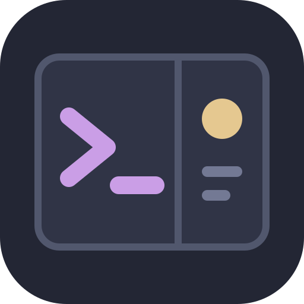
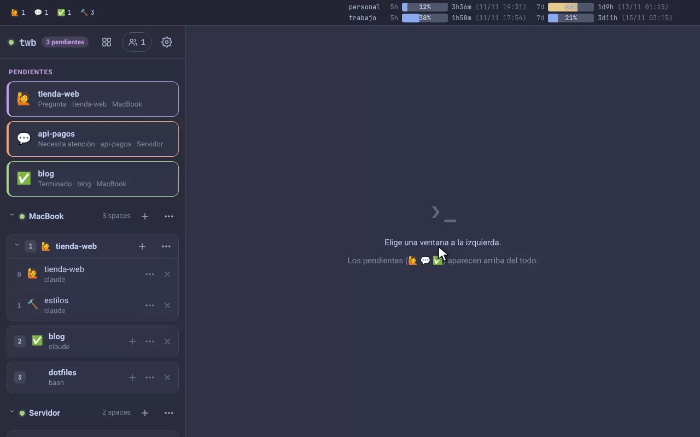
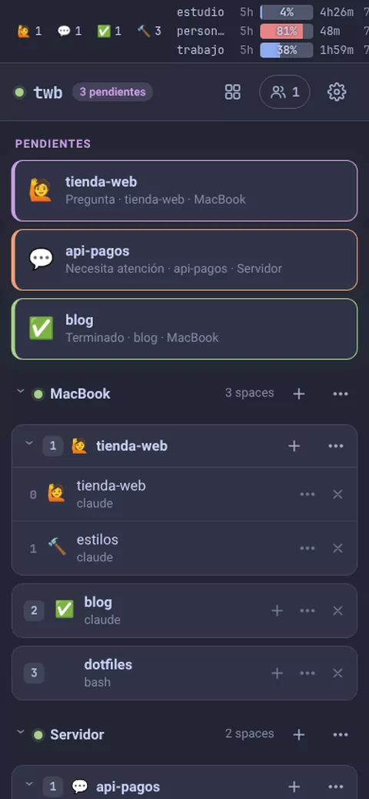
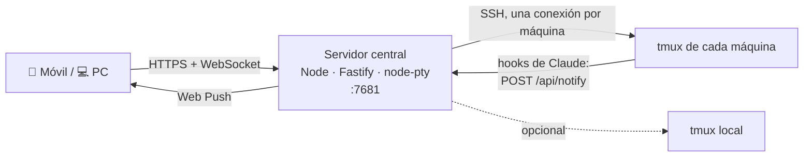

<p align="center">
  
</p>

<h1 align="center">tmux web bridge</h1>

<p align="center">
  <b>Tus sesiones de tmux y tus agentes de Claude Code, en el bolsillo.</b><br>
  Un panel web autoalojado (<b>twb</b>) para seguir, responder y dirigir a Claude Code en todas tus máquinas desde el móvil o desde cualquier navegador, sin salir de tu tailnet de Tailscale ni de tu LAN.
</p>

<p align="center">
  <a href="https://github.com/SantiagoSchez/tmux-web-bridge/releases/latest"></a>
  
  
  
</p>

<p align="center">
  <a href="#qué-hace">Qué hace</a> ·
  <a href="#en-el-móvil">En el móvil</a> ·
  <a href="#cómo-funciona">Cómo funciona</a> ·
  <a href="#instalación">Instalación</a> ·
  <a href="#cuentas-de-claude">Cuentas de Claude</a> ·
  <a href="#seguridad">Seguridad</a>
</p>

<p align="center">
  
</p>

<table>
  <tr>
    <td width="300" align="center">
      
    </td>
    <td>
      <h3>Y desde el móvil, igual de rápido</h3>
      <p>💬 <b>Un permiso</b>: lo abres desde Pendientes y lo das con el <code>Enter</code> de la barra de teclas.</p>
      <p>👉 <b>Otra ventana</b>: deslizas la cabecera.</p>
      <p>🙋 <b>Una pregunta</b>: eliges la respuesta con <code>↑</code> <code>↓</code>.</p>
      <p>☰ <b>Todas tus máquinas</b>: deslizas desde el borde.</p>
      <p>🔁 <b>Otra cuenta de Claude</b>: tocas su nombre en la barra de límites y eliges la máquina.</p>
      <p>🔔 Y si no estás mirando, te llega una <b>notificación</b> con la pregunta y botones para responder.</p>
    </td>
  </tr>
</table>

## Qué hace

### 🙋 Claude te avisa y tú contestas desde donde estés

- **Pendientes primero.** Los Claude que te esperan (🙋 pregunta, 💬 permiso, ✅ terminado) salen arriba, de todas las máquinas, con desde cuándo esperan y, si terminaron, cuánto trabajaron.
- **Actividad** (el botón con el pulso de la cabecera): lo que ha pasado en los últimos 7 días en todas las máquinas, agrupado por días. Recoge qué Claude preguntó, cuál pidió permiso y cuál terminó, y tras cuánto tiempo; qué tareas se lanzaron y desde dónde (Trello, la extensión, el panel o una automatización); y qué automatizaciones se saltaron o fallaron. Tocar una fila abre su ventana, si sigue abierta.
- **Notificaciones push** (Web Push) con el texto de la pregunta, y botones para responder desde la propia notificación.
- **Vista de ventanas**: todas las ventanas abiertas en miniatura y en vivo, con sus paneles y tituladas «espacio › ventana». Un toque abre la que quieras.

### 📱 Una terminal de verdad en el móvil

- **Terminal completa** (xterm.js) con una barra de teclas para el móvil que editas en ⚙️ **Ajustes › Teclas** para todos los dispositivos: reordenas los botones arrastrándolos, les cambias el nombre, los quitas o creas los tuyos (una tecla con Ctrl/Alt, o un texto como `/clear` con o sin Enter). Cada pestaña tiene su propia ventana actual, así que navegar desde el móvil no mueve el tmux del ordenador.
- **Seleccionar y copiar con el dedo**: pulsación larga, asas para ajustar cada extremo y una lupa sobre el dedo. Al copiar (con el dedo, arrastrando en tmux o con Option+arrastrar y Cmd+C), los párrafos de Claude Code salen enteros: sin los saltos de línea que pone al ancho de la pantalla, sin la barra «▎» de las citas y sin su «●» ni su sangría. Si eso cambia algo, el aviso trae «Copiar tal cual» para copiar el texto como estaba.
- **Ficheros en el panel**: las rutas que escribe Claude en la terminal (`Update(src/app.ts)`, `docs/plan.md:12`, `/tmp/captura.png`) se tocan o se pulsan para verlas sin salir del panel: las imágenes y los PDF tal cual, el Markdown renderizado y cualquier otro texto con sus números de línea, saltando a la que diga la ruta. Con ratón, basta con dejarlo un momento encima para ver una miniatura. Los ficheros se leen por partes, así que valen de cualquier tamaño: de un texto muy grande el visor enseña los primeros 2 MB, y «Abrir aparte» lo trae entero. El botón **+12 −3** de la cabecera de la ventana (junto a ···) dice cuántas líneas ha cambiado Claude en el repo: en la rama principal, lo que aún no tiene commit; en cualquier otra (un worktree, una rama de una tarjeta), toda la rama desde que salió de la principal. Abre **Ficheros cambiados**, que lista esos ficheros, con un buscador y una pestaña para pasar al otro modo, y el diff de cada uno.
- **Dictado sin salir de tu red**: mantienes pulsado 🎤 (o el atajo, Ctrl+Shift+Espacio por defecto) mientras hablas, sueltas y el texto aparece en el panel. En los ajustes eliges entre mantener o tocar y volver a tocar, y cambias el atajo. Lo transcribe Parakeet v3 en el servidor central, y un modelo local (Qwen3.5 4B) quita las muletillas y corrige los términos técnicos con lo que hay en la pantalla.

### 🖥️ Todas tus máquinas en un solo panel

- **Varias máquinas** (macOS, Linux, WSL) desde un único servidor central, por SSH.
- **Control completo** de espacios (cada uno es una sesión de tmux), ventanas y paneles. «Nuevo espacio» abre un proyecto y arranca `claude` en él; «Nueva ventana» ofrece las mismas carpetas y abre la ventana en ese espacio. Si la carpeta es un repo de git, antes pregunta dónde arranca Claude: **sin worktree**, en la carpeta del proyecto; en uno de los **worktrees que ya tiene** el repo, en su carpeta y en una ventana con su nombre; o en un **worktree nuevo** (`claude --worktree <nombre>`, que pasa por tu hook `WorktreeCreate` si lo tienes), también en una ventana con ese nombre y con un prompt opcional.
- **Carpetas por máquina** en ⚙️ **Ajustes › Carpetas**, con un navegador de carpetas o escribiendo la ruta: una sola, o todas las que tenga dentro (siempre al día, y ahí se pueden crear proyectos nuevos). Ahí se elige también el comando que se escribe al abrir. Todo se guarda en el servidor central; si una config antigua tiene un bloque `projects`, el hub lo pasa a Ajustes la primera vez que arranca.
- **Automatizaciones** en ⚙️ **Ajustes › Automatizaciones**: prompts que el servidor central lanza solo, a su hora (la del servidor central; Europe/Madrid en Docker), en una ventana nueva del espacio de una carpeta y, si quieres, cada vez en un worktree nuevo (`deps-nocturnas-20261112-1800`). El horario se elige por días y hora, cada N horas o con una expresión cron. Si la ejecución anterior sigue trabajando o esperándote, esa vez se salta y queda apuntado; si una no se puede lanzar (la máquina sin conexión, por ejemplo), llega una notificación. También se ejecutan a mano con «Ejecutar ahora».
- **Tareas desde Trello**: con la cuenta de Trello del panel (⚙️ **Ajustes › Trello**), el botón de tablero de la cabecera enseña las listas y tarjetas de tus tableros, con un buscador por título o número; una tarjeta lanza un Claude con ella («Haz la tarjeta …», plantilla editable) en la máquina que elijas, en el espacio de una carpeta o en una ventana nueva de un espacio abierto (en su carpeta o en otra), si quieres en un worktree nuevo (`142-arreglar-login-movil`), y la mueve a Doing con un comentario. Lo mismo hace, desde trello.com, una extensión de Chrome que añade un botón a cada tarjeta. Se conecta con su propio token, que se genera y se revoca en ⚙️ **Ajustes › Trello**, donde también se activa en la máquina donde usas Chrome: su kit la descarga y la pone al día en cada actualización. Está en [`trello-extension/`](trello-extension/README.md).

### 📊 Límites y cuentas de Claude siempre a la vista

- **Límites de uso** de Claude (5 h, semanal y el semanal de cada modelo) de todas tus cuentas, y quién está conectado al panel.
- **Cambiar de cuenta de Claude con un toque**: «Usar aquí» (o el menú de la cuenta) pasa el Claude Code de una máquina a otra cuenta, sin reiniciar los Claude que estén abiertos. Ver [Cuentas de Claude](#cuentas-de-claude).

## En el móvil

<table>
  <tr>
    <td align="center" width="33%"><a href="docs/videos/navegar.webm"></a></td>
    <td align="center" width="33%"><a href="docs/videos/responder.webm"></a></td>
    <td align="center" width="33%"><a href="docs/videos/seleccionar.webm"></a></td>
  </tr>
  <tr>
    <td align="center"><b>Moverse</b><br>De un pendiente a su ventana, deslizar la cabecera para cambiar de ventana y el borde para abrir el cajón.</td>
    <td align="center"><b>Responder</b><br>Flechas y Enter de la barra de teclas para contestar a Claude.</td>
    <td align="center"><b>Seleccionar y copiar</b><br>Pulsación larga, lupa, asas y botón «Copiar».</td>
  </tr>
</table>

<p align="center"><sub>Toca un vídeo para verlo a más resolución (WebM).</sub></p>

## Cómo funciona


```mermaid
flowchart LR
  B["📱 Móvil / 💻 PC"] -- "HTTPS + WebSocket" --> H["Servidor central<br/>Node · Fastify · node-pty<br/>:7681"]
  H -- "SSH, una conexión por máquina" --> M["tmux de cada máquina"]
  H -. "opcional" .-> L["tmux local"]
  M -- "hooks de Claude:<br/>POST /api/notify" --> H
  H -- "Web Push" --> B
```

El servidor central lee el árbol de tmux de cada máquina cada segundo y lo manda a los navegadores por WebSocket. Cada terminal es una sesión de tmux agrupada (`_tw-*`) que se destruye al cerrar la pestaña. Los estados salen de las opciones `@pane_icon`/`@win_icon` que pone el kit de cada máquina.

| Carpeta | Contenido |
| --- | --- |
| `server/` | Servidor central (TypeScript, Fastify, node-pty, web-push) |
| `web/` | App web (Preact, xterm.js), instalable como PWA |
| `shared/` | Tipos compartidos |
| `host-kit/` | Kit de cada máquina: estados de Claude, espacios, status line, hooks e instalador |
| `trello-extension/` | Extensión de Chrome que lanza un Claude con una tarjeta de Trello |
| `deploy/` | Instalación del servidor central (systemd o Docker) |

## Instalación

Cuatro pasos. Necesitas:

- **Un Linux siempre encendido** para el servidor central (un mini PC, una Raspberry Pi, un LXC…), con Node.js 22+, `build-essential` y `python3`.
- **Tailscale** en él y en tus máquinas (macOS, Linux o WSL), cada una con **tmux 3.2+**.

### 1. Instala el servidor central

En el Linux que hará de servidor central:

```sh
git clone https://github.com/SantiagoSchez/tmux-web-bridge.git ~/tmux-web-bridge
~/tmux-web-bridge/deploy/install-hub.sh
sudo loginctl enable-linger $USER   # que siga en marcha sin tener la sesión abierta
sudo tailscale serve --bg 7681      # el panel, con HTTPS, solo en tu tailnet
```

El instalador compila, crea `config.yaml`, genera la clave SSH del servidor e instala el servicio. **Al terminar imprime lo que necesitas para los pasos siguientes**: la URL del panel, la clave pública y el comando del kit con tu token. Se entra con tu identidad de Tailscale, sin contraseña.

<details>
<summary>Alternativa: con Docker, detrás de tu proxy y con contraseña</summary>

Por ejemplo, en un LXC de Proxmox. Así funciona también desde la LAN sin Tailscale:

```sh
mkdir -p ~/docker/stacks/twb && cd ~/docker/stacks/twb
git clone https://github.com/SantiagoSchez/tmux-web-bridge.git app
cp app/deploy/docker/compose.yaml . && cp app/config.example.yaml config.yaml
mkdir -p data ssh tailscale/state && chmod 700 ssh
ssh-keygen -t ed25519 -N '' -C twb -f ssh/id_ed25519
docker compose run --rm -it twb node server/dist/index.js hash-password   # → auth.passwordHash
printf 'TS_HOSTNAME=mi-twb\nTS_AUTHKEY=tskey-auth-...\nTWB_BIND=10.0.0.5\n' > .env && chmod 600 .env
docker compose up -d --build
```

Tailscale va como contenedor auxiliar (modo userspace) y el servidor central entra a las máquinas por su proxy SOCKS5. Los detalles están comentados en `compose.yaml` y `config.example.yaml`. En el proxy, admite WebSocket y sube `proxy_read_timeout`, porque las terminales pasan horas abiertas.
</details>

### 2. Añade tus máquinas

En `~/tmux-web-bridge/config.yaml`, una entrada por máquina en `hosts` (el ejemplo comentado trae más opciones):

```yaml
hosts:
  - id: mac                    # el que usarás al instalar el kit
    name: MacBook              # el que verás en el panel
    ssh: usuario@macbook       # su nombre en la tailnet
    identityFile: ~/.ssh/tmux-web-bridge_ed25519
```

Reinicia el servidor con `systemctl --user restart tmux-web-bridge`. Después, en **cada máquina**, pega en `~/.ssh/authorized_keys` la línea con la clave que imprimió el instalador:

```
from="100.x.y.z" ssh-ed25519 AAAA... tmux-web-bridge
```

<details>
<summary>Linux, WSL, tmux en otra ruta y el propio servidor como máquina</summary>

- **Linux**: activa también `sudo loginctl enable-linger $USER` en la máquina; sin él, systemd mata tus sesiones de tmux al cerrarse la última conexión SSH.
- **WSL**: instala Tailscale dentro de la distro o usa `networkingMode=mirrored`.
- **tmux fuera del `PATH`** (por ejemplo, Homebrew en macOS): `tmux: /opt/homebrew/bin/tmux`. Para un servidor de tmux no estándar, `socketName` o `socketPath`.
- **El propio servidor central** también puede ser una máquina, sin SSH: `local: true`.
</details>

### 3. Instala el kit en cada máquina

En cada máquina con Claude Code, el comando que imprimió el instalador (con la URL del panel, el `id` de la máquina y tu token):

```sh
git clone https://github.com/SantiagoSchez/tmux-web-bridge.git ~/tmux-web-bridge
~/tmux-web-bridge/host-kit/install.sh --hub https://<url-del-panel> --host <id> --token <notifyToken>
```

Con eso, el panel ya ve los estados de Claude y te avisa en el móvil. Para comprobar la conexión, `install.sh --check`; para actualizarlo, ver [Actualizaciones](#actualizaciones).

<details>
<summary>Qué toca el kit en la máquina</summary>

Enlaza los scripts de estados de Claude, de espacios y la status line; añade un `source-file` a tu `~/.tmux.conf`, fusiona los hooks en `~/.claude/settings.json` y guarda lo propio de la máquina en `~/.config/tmux-web-bridge/notify.env`. Lo que hubiera antes se guarda en `.bak.<fecha>`.

Los enlaces son relativos y el `source-file` usa `~`, así que valen aunque `~/.scripts` o `~/.tmux.conf` vivan en unos dotfiles compartidos entre máquinas, siempre que todas tengan el clon en `~/tmux-web-bridge`. Si Claude Code usa otra carpeta de configuración, `--claude-dir` (o `CLAUDE_CONFIG_DIR` al instalar); se recuerda para las siguientes actualizaciones.

La status line del kit muestra los límites 5h/7d al final, salvo en un panel estrecho (el móvil, donde ya están en la franja de la app). Si la barra de tmux ya los muestra (por ejemplo, con un módulo de catppuccin), quítalos de la status line de todas las máquinas en ⚙️ **Ajustes › Máquinas › Límites en la status line**: el servidor central pone `@claude_limits_in_status` en el tmux de cada una y la vuelve a poner si tmux se reinicia, por encima de lo que diga su `~/.tmux.conf`.
</details>

<details>
<summary>Usar tu propia status line en vez de la del kit</summary>

El panel saca los límites de uso de una opción global de tmux que publica la status line (Claude Code solo le pasa `rate_limits` a ella), con una entrada por cuenta separada por `;`: `pct5h reset5h pct7d reset7d actualizado email`. El email sale de `oauthAccount.emailAddress` en `.claude.json` y la barra muestra una fila por cuenta. Si instalas con `--skip-claude`, copia a la tuya el bloque «Límites de uso para el panel web» de [`host-kit/statusline.sh`](host-kit/statusline.sh), después de leer el JSON en `$input` y sacar de él `PCT_5H`, `RESET_5H`, `PCT_7D` y `RESET_7D`.
</details>

### 4. Ábrelo en el móvil

Abre la URL del panel en Chrome (Android), **Añadir a pantalla de inicio**, y activa las notificaciones en ⚙️ **Ajustes › Dispositivo › Notificaciones**. Listo.

### Extra: dictado

Se activa en ⚙️ **Ajustes › Dictado** y vale para todos los dispositivos. Todo corre en CPU en tu servidor central. El navegador necesita HTTPS para usar el micrófono.

<details>
<summary>Modelos, memoria y cómo activar la limpieza del texto</summary>

- **Transcripción**: Parakeet TDT 0.6B v3 (sherpa-onnx) dentro del propio servidor. Se descarga en `data/models` la primera vez (unos 670 MB), ocupa ~1 GB de RAM y transcribe 30 s de audio en unos 2 s con 4 hilos.
- **Limpieza** (opcional): Qwen3.5 4B Q4_K_M detrás de llama-server, unos 3 GB de RAM. Con Docker es el servicio `llm` de `compose.yaml` (`docker compose up -d llm`). Sin Docker, arranca tú `llama-server -hf unsloth/Qwen3.5-4B-GGUF:Q4_K_M --jinja` y pon su URL en `dictation.llmUrl` de `config.yaml`. Tarda unos segundos por dictado; si pasa del tiempo máximo que elijas en Ajustes (10 s por defecto), el texto va tal y como se oyó. El glosario viene con términos habituales de Claude Code, git y Docker, y se edita ahí mismo.

Los modelos más pequeños (Qwen3.5 0.8B y 2B) se probaron con dictados en español y no sirven para esto: el 0.8B cambia el sentido de las frases y el 2B casi no limpia.
</details>

## Cuentas de Claude

El servidor central guarda los inicios de sesión de tus cuentas de Claude. Con ellos lee el uso de todas, también de las que no tienen ningún Claude abierto, y puede pasar cualquier máquina de una cuenta a otra. Todo se gestiona desde la franja de límites:

- **Las cuentas que ya usas aparecen solas.** El servidor central mira por SSH con qué cuenta está Claude Code en cada máquina (al arrancar y cada 10 minutos) y se queda con ella. Para añadir otra, pulsa el nombre de una cuenta › **Añadir otra cuenta**: se abre el login de Claude en otra pestaña y pegas el código que muestra, como con `/login`.
- **«Usar aquí»**, con una ventana abierta, pasa el Claude Code de esa máquina a esa cuenta (en pantalla ancha; **●** marca dónde está en uso). El nombre de cada cuenta abre su menú: las máquinas donde está en uso y «Usar en una máquina…», con la de la ventana abierta la primera; en el móvil, se cambia desde ahí.
- **Sin reiniciar nada**: los Claude abiertos siguen con la cuenta nueva desde su siguiente mensaje (o en unos 30 segundos, en un Mac que guarde la sesión en el Llavero).

<details>
<summary>Cómo funciona por dentro</summary>

- **Un inicio de sesión vale para una sola máquina a la vez**, porque cada token de refresco de Claude solo se puede usar una vez: si dos copias del mismo login se renovaran por su lado, una dejaría a la otra sin sesión. Al cambiar, el login que tenía la máquina vuelve al servidor central como «sesión libre» y la máquina recibe una sesión libre de la cuenta nueva. Para tener la misma cuenta en dos máquinas a la vez hacen falta dos inicios de sesión con ella: si no hay ninguna libre, TWB te pide uno.
- **Qué toca en cada máquina**: la credencial (`~/.claude/.credentials.json`; en macOS, el ítem «Claude Code-credentials» del Llavero si Claude Code llega a él, y el mismo fichero si no) y `oauthAccount` en `~/.claude.json`, con los mismos bloqueos que usa Claude Code para que un cambio no se cruce con una renovación del token. Solo la carpeta de configuración por defecto (no `CLAUDE_CONFIG_DIR`).
- **macOS**: el Llavero de inicio de sesión no se abre por SSH ni a un tmux arrancado fuera de la sesión gráfica, y Claude Code guarda entonces la sesión en ese fichero; el hub usa lo que encuentre: el Llavero si le contesta, el fichero si no. Un Claude abierto desde la sesión gráfica del Mac (fuera de tmux) lee antes el Llavero, así que puede seguir con la cuenta que haya allí.
- **Dónde se guardan**: en `accounts.json`, dentro de `dataDir` del servidor central, legible solo por su usuario. El uso se consulta como mucho cada 5 minutos por cuenta, para no pasarse del límite de peticiones de Anthropic.
</details>

## Actualizaciones

La versión está en [`VERSION`](VERSION) y cada una se publica como release en GitHub. Una vez al día el servidor central consulta la última release (solo hace esa petición, no envía ningún dato) y, si es más nueva que él o que el kit de alguna máquina, el panel lo avisa con una franja arriba que se queda hasta que la cierras. Cerrada, no vuelve hasta la siguiente release. Se desactiva para todos los dispositivos en ⚙️ **Ajustes › Máquinas › Buscar actualizaciones**.

- **Servidor central**: `git pull` en su clon y otra vez `deploy/install-hub.sh` (o reconstruir la imagen de Docker).
- **Kit de las máquinas**: desde el propio panel, con el botón **Actualizar** del aviso o con **Actualizar el kit a vX.Y.Z** en el menú de cada máquina. Tras confirmar, el servidor central entra en ella por el mismo SSH de siempre, pasa el clon a la última release (`git fetch --tags` y `git checkout vX.Y.Z`, que deja el clon en HEAD separado), vuelve a aplicar el kit y recarga su `tmux.conf`. Nunca fuerza nada: con cambios locales en el clon, no lo toca. No se cierra ningún espacio y los Claude abiertos no se reinician.

A mano es lo mismo, en el clon:

```sh
git fetch --tags && git checkout vX.Y.Z   # un hook de git vuelve a aplicar el kit
```

Con el clon en una release, `git pull` ya no funciona («You are not currently on a branch»).

## Seguridad

- **Dos formas de entrar, nunca mezcladas** (`auth.method`):
  - `tailscale`: solo por `tailscale serve`, con la cabecera `Tailscale-User-Login` y la lista `auth.allowedLogins`.
  - `password`: detrás de cualquier otro proxy, con hash scrypt, cookie `HttpOnly`, límite de intentos, verificación en dos pasos opcional (TOTP) y cierre remoto de sesiones. Las cabeceras de Tailscale se ignoran.
- La API y los WebSocket exigen sesión y mismo origen; `/api/notify` exige el `notifyToken`.
- El servidor central entra en las máquinas con su propia clave, limitable con `from=`. `config.yaml`, `notify.env` y las claves VAPID se guardan con permisos 600.
- La extensión de Trello solo llega a `/api/ext/*`, y solo con su token (`Authorization: Bearer`). El servidor central guarda su hash en `ext-token.json`, con permisos 600; revocarlo en Ajustes lo invalida al momento. La API key y el token de Trello se guardan en `trello.json`, también con permisos 600, y no vuelven a salir del servidor central.

### API de la extensión de Trello

La usa [`trello-extension/`](trello-extension/README.md). Todas con `Authorization: Bearer <token>`, desde cualquier origen:

| Ruta | Qué hace |
| --- | --- |
| `GET /api/ext/ping` | Comprueba la dirección y el token. |
| `GET /api/ext/trello` | Si el panel tiene cuenta de Trello, y cuál (`TrelloInfo`). |
| `GET /api/ext/card/:id` | La tarjeta y la plantilla del prompt (`TrelloCardContext`). |
| `GET /api/ext/targets` | Cada máquina con su estado, sus espacios abiertos y sus carpetas de «Nuevo espacio» (`ExtTargets` en `shared/types.ts`). |
| `POST /api/ext/launch` | `{ host, target: { session } \| { folder, sub? } \| { session, folder, sub? }, prompt, name?, skipPermissions?, worktree? }`. Abre una ventana nueva llamada `name` (fijada) en ese espacio, o en el de la carpeta, que se crea si no está abierto (y entonces la tarea va en su primera ventana); con los dos, en ese espacio y en la carpeta, y escribe `claude --permission-mode auto '<prompt>'` (o `--dangerously-skip-permissions`), con `--worktree '<worktree>'` si se pide; entonces el prompt es opcional. Con `card` (el id de la tarjeta), el panel la mueve después a Doing y la comenta, y lo cuenta en `trello` (`TrelloAfterLaunch`). Usa el comando de la máquina si es `claude …`; si no, `claude`. |

## Desarrollo

```sh
pnpm install
cp config.example.yaml config.yaml   # con allowWithoutTailscale: true y un host local: true
pnpm --filter web build && ./restart-dev.sh     # http://127.0.0.1:7681 (log en server-dev.log)
pnpm typecheck
pnpm test
scripts/test-kit-update.sh   # «Actualizar el kit» de punta a punta, aislado (HOME, git y tmux temporales)
```

## Solución de problemas

| Síntoma | Causa probable |
| --- | --- |
| Una máquina sale «sin conexión» | Pasa el ratón (o toca) «sin conexión» para ver el error de ssh, y prueba `ssh` a mano desde el servidor central. Sus espacios dejan de mostrarse al minuto sin respuesta, porque ya no se sabe qué tiene abierto. |
| No llegan notificaciones | ⚙️ Ajustes › Dispositivo › Enviar prueba; `host-kit/install.sh --check` en la máquina. |
| 401 al abrir el panel | Con `auth.method: tailscale`, estás entrando sin `tailscale serve`. |
| «Código incorrecto» en la verificación en dos pasos | La hora del móvil o del servidor va desfasada más de 30 s. |
| `posix_spawnp failed` | Permisos del `spawn-helper` de node-pty: `node scripts/fix-node-pty.mjs`. |
